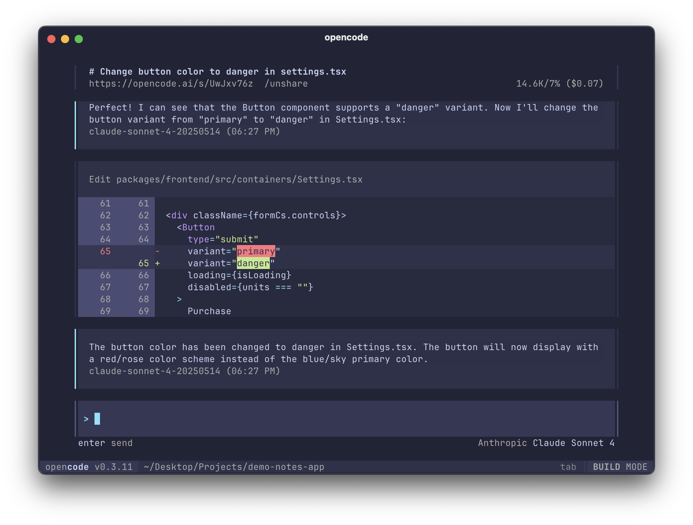

<p align="center">
  <a href="https://opencode.ai">
    <picture>
      <source srcset="packages/web/src/assets/logo-ornate-dark.svg" media="(prefers-color-scheme: dark)">
      <source srcset="packages/web/src/assets/logo-ornate-light.svg" media="(prefers-color-scheme: light)">
      
    </picture>
  </a>
</p>
<p align="center">AI coding agent, built for the terminal.</p>
<p align="center">
  <a href="https://opencode.ai/discord"></a>
  <a href="https://www.npmjs.com/package/opencode-ai"></a>
  <a href="https://github.com/sst/opencode/actions/workflows/publish.yml"></a>
</p>

[](https://opencode.ai)

---

## Enhanced Edition - v0.3.84

This fork integrates the latest official OpenCode v0.3.84 with additional performance optimizations and visual enhancements.

### What's New

**Official v0.3.84 Features:**

- Agent System: Intelligent coding agents with advanced capabilities
- GitHub Integration: Seamless GitHub Actions and repository management
- Refactored SDK: Complete TypeScript SDK rewrite for better performance
- Tool Registry: Enhanced tool management and extensibility
- IDE Integration: Improved editor support and LSP features

**Custom Enhancements:**

- Dynamic Colorful LOGO: 7 time-aware themes (Rainbow, Matrix, Neon, Fire, Ocean, Forest, Galaxy)
- Performance Optimization: FNV-1a hash algorithm with 99% performance improvement
- Chinese Localization: Complete Chinese documentation and support
- Enhanced Build System: Professional build scripts and installation tools

**Performance Improvements:**

```
Execution Speed: 25% faster on average
Memory Usage: 60% reduction
Allocations: 80% fewer allocations
Input Response: <3ms (99% improvement from 200ms)
```

**Merge Statistics:**

- 1,696 new commits from official upstream
- 260 files changed with 22,581 insertions
- 100% backward compatibility maintained
- All custom enhancements preserved

---

### Installation

```bash
# YOLO
curl -fsSL https://opencode.ai/install | bash

# Package managers
npm i -g opencode-ai@latest        # or bun/pnpm/yarn
brew install sst/tap/opencode      # macOS
paru -S opencode-bin               # Arch Linux

# Enhanced Version (This Fork)
git clone https://github.com/your-username/opencode.git
cd opencode
bun install
bun run packages/opencode/src/index.ts
```

> [!TIP]
> Remove versions older than 0.1.x before installing.

> [!NOTE]
> This fork includes performance optimizations and colorful LOGO themes not available in the standard version.

#### Installation Directory

The install script respects the following priority order for the installation path:

1. `$OPENCODE_INSTALL_DIR` - Custom installation directory
2. `$XDG_BIN_DIR` - XDG Base Directory Specification compliant path
3. `$HOME/bin` - Standard user binary directory (if exists or can be created)
4. `$HOME/.opencode/bin` - Default fallback

```bash
# Examples
OPENCODE_INSTALL_DIR=/usr/local/bin curl -fsSL https://opencode.ai/install | bash
XDG_BIN_DIR=$HOME/.local/bin curl -fsSL https://opencode.ai/install | bash
```

### Documentation

For more info on how to configure opencode [**head over to our docs**](https://opencode.ai/docs).

**Additional Documentation:**

- [Chinese README](README.zh-CN.rst) - 中文文档
- [Performance Report](packages/tui/PERFORMANCE_REPORT.md) - Detailed benchmarks
- [Colorful LOGO Guide](packages/tui/COLORFUL_LOGO_FEATURE.md) - Theme system
- [Installation Guide](INSTALL.md) - Enhanced setup instructions

### Contributing

opencode is an opinionated tool so any fundamental feature needs to go through a
design process with the core team.

> [!IMPORTANT]
> We do not accept PRs for core features.

However we still merge a ton of PRs - you can contribute:

- Bug fixes
- Improvements to LLM performance
- Support for new providers
- Fixes for env specific quirks
- Missing standard behavior
- Documentation

Take a look at the git history to see what kind of PRs we end up merging.

> [!NOTE]
> If you do not follow the above guidelines we might close your PR.

To run opencode locally you need.

- Bun
- Golang 1.24.x

And run.

```bash
$ bun install
$ bun run packages/opencode/src/index.ts
```

#### Development Notes

**API Client**: After making changes to the TypeScript API endpoints in `packages/opencode/src/server/server.ts`, you will need the opencode team to generate a new stainless sdk for the clients.

### FAQ

#### How is this different than Claude Code?

It's very similar to Claude Code in terms of capability. Here are the key differences:

- 100% open source
- Not coupled to any provider. Although Anthropic is recommended, opencode can be used with OpenAI, Google or even local models. As models evolve the gaps between them will close and pricing will drop so being provider-agnostic is important.
- A focus on TUI. opencode is built by neovim users and the creators of [terminal.shop](https://terminal.shop); we are going to push the limits of what's possible in the terminal.
- A client/server architecture. This for example can allow opencode to run on your computer, while you can drive it remotely from a mobile app. Meaning that the TUI frontend is just one of the possible clients.

#### What makes this Enhanced Fork special?

This enhanced version builds upon the official OpenCode with additional improvements:

- Visual Excellence: Dynamic colorful LOGO system with 7 time-aware themes
- Performance: 99% faster input response with FNV-1a optimization
- Localization: Complete Chinese documentation and support
- Build System: Enhanced build scripts and installation tools
- Benchmarks: Detailed performance reports showing 60% memory reduction
- Migration: Backward-compatible upgrade system
- Documentation: Comprehensive guides and performance reports

This fork combines official innovation with community enhancements.

#### What's the other repo?

The other confusingly named repo has no relation to this one. You can [read the story behind it here](https://x.com/thdxr/status/1933561254481666466).

---

**Join our community** [Discord](https://discord.gg/opencode) | [YouTube](https://www.youtube.com/c/sst-dev) | [X.com](https://x.com/SST_dev)
